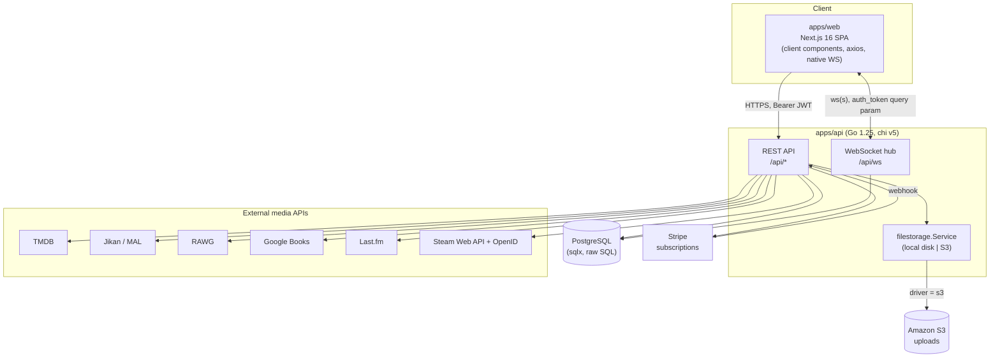
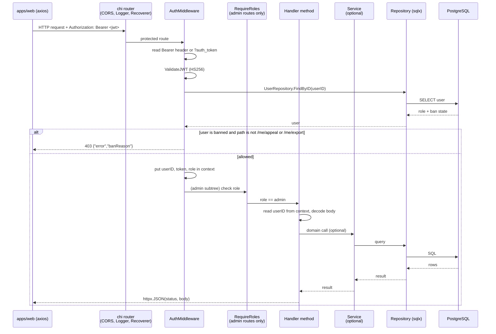

# Architecture

Completionist is a media tracking and social platform. Users keep lists of the
movies, shows, anime, manga, games, books, and music they are working through,
review and discuss them, earn XP and ranks, watch or listen together in
realtime rooms, and connect external accounts (Steam, Last.fm) to pull in their
existing libraries.

This document describes how the system is put together: the major components,
the layered Go backend, the exact path a request takes from HTTP to the
database, the data model, realtime messaging, external integrations, auth and
access control, and the supporting tooling (migrations and API docs).

It describes the code as it is wired today. Where a piece exists but is only
partially used, that is called out rather than glossed over.

## Components

The product is a monorepo with two deployable apps plus a set of external
dependencies.

- **apps/api** is the Go 1.25 backend. It is a single module
  (`github.com/nearestdev/completionist`) built on go-chi/chi v5, talking to
  PostgreSQL through jmoiron/sqlx over the lib/pq driver. It owns auth, all
  domain logic, persistence, the WebSocket hub, and every outbound call to a
  third-party API. It serves a REST API under `/api` and a WebSocket endpoint at
  `/api/ws`.
- **apps/web** is the Next.js 16 frontend (App Router, TypeScript, Tailwind, bun).
  Every page is a client component. All HTTP goes through one shared axios
  instance that attaches the JWT from `localStorage` as a Bearer token, and
  realtime uses a native browser WebSocket. There is no server-side data
  fetching; the frontend is effectively a SPA that consumes the Go API.
- **PostgreSQL** is the system of record. There is no ORM and no second
  datastore (no Redis, no separate cache). Repositories run raw SQL.
- **Amazon S3** backs uploaded files when `STORAGE_DRIVER=s3`. Otherwise the API
  writes to local disk and serves the files itself. The choice is made once at
  startup behind a storage interface, so handlers never know which backend is
  active.
- **Stripe** handles subscription billing. The API creates Checkout and billing
  portal sessions and receives webhook callbacks that flip a user to the paid
  `member` role.
- **External media APIs** supply catalog data and account imports: TMDB (movies,
  TV), Jikan (anime, manga via MyAnimeList), RAWG (games), Google Books, Last.fm
  (scrobbles), and Steam (owned games, achievements, OpenID login).

## Backend layers

The backend follows a straight `handler -> service -> repository -> PostgreSQL`
flow. There is no DI framework: `cmd/api/main.go` is the composition root and
wires everything by hand. It loads config, connects the database, runs
migrations, constructs every repository, then every service, then a single
`handler.Handler` that receives all of them, and finally hands that handler to
the router.

The packages under `internal/` and their responsibilities:

- **config** (`internal/config`): one `Config` struct and `Load()`. Reads a
  `.env` file (trying `./`, `../`, `../../`) and then environment variables.
  Also exposes `ResolveAppPath`, which finds `migrations/` and `uploads/`
  whether the binary runs from `apps/api` or the repo root. No viper, no
  structured config library.
- **database** (`internal/database`): `Connect` opens the sqlx pool against
  Postgres, and `RunMigrations` applies pending migrations through
  golang-migrate. Both are called at startup.
- **bootstrap** (`internal/bootstrap`): `EnsureDevAdmin` seeds a development
  admin account on startup. It is a development convenience, not a production
  path.
- **auth** (`internal/auth`): owns the JWT. `GenerateJWT` issues an HS256 token
  carrying a `UserID` claim; `ValidateJWT` parses and verifies it. The signing
  key is read directly from the `JWT_SECRET` environment variable inside this
  package.
- **middleware** (`internal/middleware`): two pieces. `AuthMiddleware` extracts
  the token, validates it, loads the current user from the database (so role and
  ban state are always live, never trusted from the token), enforces the ban
  rule, and stores `userID`, the raw token, and the user's role in the request
  context. `RequireRoles` is the RBAC gate: it reads the role from context and
  allows the request only if it matches one of the permitted roles.
- **models** (`internal/models`): plain domain structs and request/response
  payload types for all domains. These carry `db` and `json` struct tags and no
  behavior beyond small helpers like `UserRole.IsMemberOrAbove()`.
- **repository** (`internal/repository`): one file per domain. Each repository
  holds a `*sqlx.DB` and runs raw SQL directly (`Get`, `QueryRowx`,
  `StructScan`, and so on). There is no base repository and no shared query
  builder.
- **services** (`internal/services`): logic that spans multiple repositories or
  wraps an external concern. This includes `BadgeService`, `StreakService`,
  `RankService`, `ModerationService`, `SuggestionService`, `StripeService`,
  `FranchiseDiscoveryService`, the challenges service, the importer, the
  progress validator, and the file storage abstraction. The external API clients
  (jikan, tmdb, rawg, steam, googlebooks, lastfm) also live here as their own
  subpackages.
- **httpx** (`internal/httpx`): two helpers, `JSON` and `JSONError`. Every
  handler writes its response through these so the content type and error shape
  (`{"error": "..."}`) stay consistent.
- **handler** (`internal/handler`): one `Handler` struct that aggregates every
  repository, service, and external client, plus a set of `func(w, r)` methods
  grouped by domain across about thirty files. Handlers read the user id from
  context, decode the request body, call a service or repository, and write the
  result with `httpx`.
- **routes** (`internal/routes`): `NewRouter` builds the chi router, attaches
  global middleware, and binds every handler method to a path. It also mounts
  the Swagger UI and the static `/uploads/*` file server.
- **websocket** (`internal/websocket`): the realtime `Hub`, the per-connection
  `Client`, and the `WSMessage` types. The hub runs in its own goroutine and
  tracks connected clients and room membership.

### Composition root

`main.go` does the wiring in a fixed order so dependencies exist before their
consumers:

1. `config.Load()`.
2. `database.Connect` then `database.RunMigrations`.
3. Construct all repositories (each takes the `*sqlx.DB`).
4. `bootstrap.EnsureDevAdmin` (development only).
5. Start the WebSocket hub: `wsHub := websocket.NewHub(messagingRepo)` then
   `go wsHub.Run()`.
6. Pick the file storage backend from `STORAGE_DRIVER` (S3 client or local disk)
   behind the `filestorage.Service` interface.
7. Construct services, passing in the repositories and config values they need.
8. Construct the external API clients from their API keys.
9. Build the single `handler.Handler` with every dependency.
10. `routes.NewRouter(appHandler, cfg)` and `http.ListenAndServe`.

The hub depends on a `MessagingRepository` interface (defined in the websocket
package), not the concrete repository type, so the realtime layer stays
decoupled from persistence details.

## Request lifecycle

Every HTTP request flows through the same stages. The router applies CORS, the
chi request logger, and the panic recoverer globally. Routes then split into a
public set and a protected group wrapped by `AuthMiddleware`; the `/api/admin`
subtree adds `RequireRoles(RoleAdmin)` on top of that.

A protected request, end to end:

1. chi matches the route and runs the global middleware (CORS, logger,
   recoverer).
2. `AuthMiddleware` runs. It reads the token from the `Authorization: Bearer`
   header, or from the `auth_token` query parameter (used by the WebSocket
   handshake, which cannot set headers). It calls `ValidateJWT`. It then loads
   the user with `UserRepository.FindByID` so the role and ban state come from
   the database, not the token.
3. Ban enforcement happens right here. If the user is banned, every path is
   rejected with `403` and a JSON ban reason except `/me/appeal` and
   `/me/export`, so a suspended user can still appeal and export their data.
4. The middleware stores the user id, the raw token, and the role in the request
   context and calls the next handler.
5. For admin routes, `RequireRoles(RoleAdmin)` reads the role from context and
   returns `403` if it is not admin.
6. The handler runs. It reads the user id via `middleware.UserIDFromContext`,
   decodes the JSON body, and calls a service (for cross-domain logic) or a
   repository directly (for straightforward reads and writes).
7. The repository runs raw SQL through sqlx against PostgreSQL.
8. The handler writes the response with `httpx.JSON` or `httpx.JSONError`. Some
   handlers also push a realtime event through the hub (see below) or record an
   audit entry.

Public routes skip steps 2 through 5 entirely. They include register, login, the
search and media endpoints, the OAuth callbacks (Steam, Last.fm, generic
connection), public franchise and season reads, the ad fetch and impression
endpoints, and the Stripe webhook.

## Data model

There are 22 domains. They group into themes:

- **Identity and access**: `user` (account, role, XP, level, ban fields),
  `role` (the `user` / `member` / `admin` enum and its helpers), `xp` (XP ledger
  and level rules), and `audit` (the audit log table).
- **Content tracking**: `media` (catalog entries cached from external sources),
  `list` (the user's tracked items, plus the wishlist and the "next up" queue),
  `collection` (user-named folders that group list items), and `franchise`
  (curated trees of related entries, browsable publicly).
- **Social**: `social` (follows, followers, suggestions), `posts` (posts,
  comments, likes, shares), and `review` (ratings and written reviews tied to
  media and users).
- **Messaging**: `messaging` covers both direct messages and rooms. Rooms come
  in chat, music, and watch types and carry shared playback state
  (current media, position, play/pause).
- **Gamification**: `challenge` (seasonal challenges), `badge` (earned badges),
  `streak` (activity streaks and their leaderboard), and `rank` (the ELO-style
  seasonal rank tied to XP).
- **Commerce**: `subscription` (Stripe subscription state per user) and
  `ad_campaign` (ad campaigns plus impression and click tracking, shown to
  non-members).
- **Moderation**: `moderation` (reports, the moderation queue, ban records and
  ban appeals).
- **Integrations**: `connected_account` (linked external accounts and import
  jobs), `steam` (linked Steam account, owned games, achievements), `lastfm`
  (linked Last.fm account and recent tracks), and `attachment` (uploaded files
  linked to other entities).

Models are persistence-shaped structs with `db` and `json` tags. The repository
layer maps rows to them with sqlx; there is no migration of behavior into the
model types.

## Realtime messaging

Realtime runs over a single WebSocket endpoint, `GET /api/ws`, inside the
authenticated route group. Because a browser WebSocket cannot send an
`Authorization` header, the client passes the JWT as the `auth_token` query
parameter, which `AuthMiddleware` already knows how to read.

The `Hub` runs in one goroutine started at boot. It owns three maps guarded by a
`sync.RWMutex`: connected clients keyed by user id, room membership (room id to
the set of user ids in it), and the channels used to register, unregister, and
hand off inbound messages. Each connection is a `Client` that wraps the gorilla
WebSocket. Frames are newline-delimited JSON `WSMessage` envelopes, each with a
`type` and a `payload`.

The defined message types are: `dm`, `room_chat`, `room_join`, `room_leave`,
`room_state`, `room_users`, `typing`, `ping`, `pong`, `reaction`, `pin`, and
`error`.

There are two ways a message reaches other users:

- **Inbound through the socket.** The hub's `processMessage` currently handles
  `room_chat`: it stamps the sender, persists the message through the
  `MessagingRepository`, and fans it out to the room with `SendToRoom`. This is
  the path the hub itself owns.
- **Outbound from REST handlers.** Most realtime effects originate from REST
  calls. A handler does its work, persists through a repository, and then pushes
  an event to recipients with the hub's `SendToUser` or `SendToRoom`. Direct
  messages, reactions, pins, room joins and leaves, and room state changes are
  delivered this way: the REST endpoint is the source of truth and the hub is
  the fan-out mechanism. The hub also exposes `AddClientToRoom`,
  `RemoveClientFromRoom`, and `GetRoomOnlineUsers` for handlers to keep room
  membership and presence in sync.

So the hub is both a small inbound processor (room chat) and a broadcast bus
that handlers use to deliver everything else.

## External integrations and file storage

Each external media client is a plain struct built from its API key in `main.go`
and held directly on the `Handler`. There is no abstraction layer between a
handler and its client.

- **TMDB** for movie and TV search, details, and trending.
- **Jikan** for anime and manga search (MyAnimeList data); needs no key.
- **RAWG** for game search and achievements.
- **Google Books** for book search.
- **Last.fm** for linking an account and pulling recent scrobbles, with an OAuth
  callback.
- **Steam** for OpenID login, owned games, achievements, and game schemas.

The importer service uses the connected-account, media, and list repositories to
turn a linked external account into tracked list items.

File storage sits behind the `filestorage.Service` interface, which is just two
methods: `Upload(ctx, reader, filename, contentType) -> (url, error)` and
`Delete(ctx, key) -> error`. There are two implementations:

- **LocalStorage** writes to a local `uploads/` directory and returns a URL under
  `/uploads`. When this driver is active, the router also mounts a static file
  server at `/uploads/*` to serve those files.
- **S3Storage** uploads to an S3 bucket using AWS SDK v2.

`main.go` picks the implementation from `STORAGE_DRIVER` (`s3` selects S3,
anything else selects local) and passes the chosen one into the handler.
Handlers call `Upload` and `Delete` without knowing which backend is behind the
interface.

## Auth, RBAC, and audit logging

**Authentication** is JWT Bearer. Login issues an HS256 token (via
`GenerateJWT`) carrying the user id. The frontend stores it in `localStorage`
and sends it on every request. On the server, `AuthMiddleware` validates the
token and then loads the user from the database, so the role and ban status used
for a request are always current. A token alone never grants a role; the
database lookup does.

**Authorization** uses three roles defined in `models.UserRole`: `user` (the
default), `member` (a paid subscriber, granted after a successful Stripe
checkout), and `admin`. `RequireRoles` enforces them, and the entire
`/api/admin` subtree is gated to `admin`. The `member` role unlocks
subscription-only behavior and removes ads. `UserRole.IsMemberOrAbove()` is the
helper for "paid or staff."

**Ban enforcement** lives in `AuthMiddleware` rather than in a separate guard. A
banned user is blocked from every endpoint with a `403` and a JSON ban reason,
except `/me/appeal` and `/me/export`, which stay open so they can contest the
ban and export their data.

**Audit logging** is an explicit repository helper, not a global interceptor.
`AuditRepository.Log(userID, entityType, entityID, action, metadata)` writes a
row to the audit table, and handlers call it where an action is worth recording
(for example, media views record a `view` action). It is opt-in per handler, so
the audit trail covers the call sites that invoke it rather than every request.

## Migrations and API docs

**Migrations** are managed with golang-migrate against versioned SQL files in
`apps/api/migrations/` (paired `NNN_name.up.sql` / `NNN_name.down.sql`).
`RunMigrations` applies anything pending at startup, in both development and
production, and treats "no change" as success, so a normal boot is also a
migration check. There is no separate manual migrate step after the initial CLI
tool install.

**API docs** are generated by swaggo from `// @` annotations in the code. The
package-level block in `main.go` sets the title ("Completionist API"), version,
host, base path (`/api`), and the `BearerAuth` security scheme. `swag init`
writes the generated spec into `apps/api/swagger/`, and the router serves the
Swagger UI at `/swagger/index.html`. The doc generation runs before the API
starts in development so the UI is always in sync with the code.
